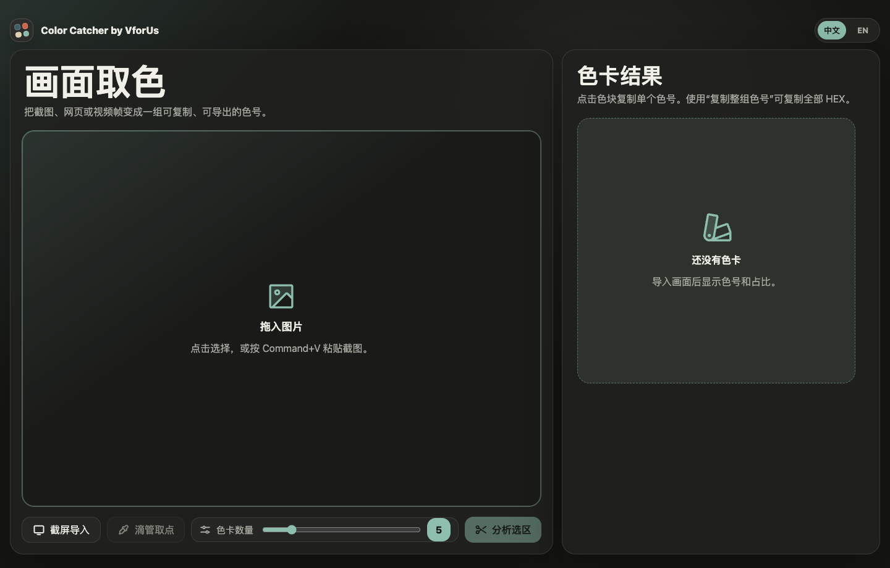

# Color Catcher by VforUs

Capture the colors from screenshots, webpages, and video frames before the creative moment disappears.

Color Catcher by VforUs turns visual references into copyable HEX, RGB, and HSL palettes. It is built for creators who find a useful look inside a frame, screenshot, poster, website, or AI video reference and want to turn it into practical color codes fast.

> Try it now: https://crazyfox2002-rain.github.io/color-catcher-by-vforus/



## Who It Is For

- AI video creators who want to match the mood of a reference frame
- Designers and brand builders who need a usable palette from screenshots, posters, webpages, or moodboards
- Frontend developers who need CSS-ready color codes from visual references
- Content creators making thumbnails, covers, decks, or social posts that need consistent color

## Why It Helps

- Grab the overall palette and exact sample-point colors in one place
- Crop out irrelevant parts of a screenshot before analyzing the colors
- Keep creative flow instead of switching into heavier design software
- Work locally in the browser without uploading private reference images
- Copy color codes or export a shareable PNG color card

## Features

- Drag, click, or paste images with Command+V / Ctrl+V
- Capture a screen, window, or browser tab with browser permission
- Crop the source image and analyze only the selected area
- Pick exact colors from the canvas with up to 10 sample markers
- Generate 4 to 10 dominant colors
- Show color proportions with a pie chart
- Copy one swatch, copy the full palette, or export a PNG color card
- Switch between Chinese and English UI
- Built with React, TypeScript, and Vite

## 中文介绍

Color Catcher by VforUs 是一个面向创作者的画面取色工具。你可以导入图片、截图、网页画面或视频帧，它会在浏览器本地分析主色调，生成可复制、可导出的色卡。

它适合这些场景：

- 做 AI 视频时，快速抓取参考帧的色彩氛围
- 设计网页、海报、封面、缩略图时，从参考图里提取主色
- 只分析截图里真正重要的一块区域，而不是整张图
- 用滴管标记具体取样点，并和整组色号一起复制
- 生成 PNG 色卡，方便保存、分享或放进创作流程

## How to Use

The easiest way is to open the GitHub Pages demo in a modern browser:

https://crazyfox2002-rain.github.io/color-catcher-by-vforus/

Recommended browsers: Chrome, Edge, or other Chromium-based browsers.

For screen capture, the browser will always ask for permission first. Color Catcher cannot silently capture your screen. After capturing, use the crop box to keep only the area you want to analyze.

## 本机使用方式

如果只是想方便使用，不想每次启动临时测试地址，推荐两种方式：

1. 使用 GitHub Pages 在线版  
   打开上面的在线地址，然后把它加入浏览器书签。Chrome 也可以把网页添加到 Dock 或桌面快捷方式，日常使用最省心。

2. 在本机运行一份固定版本  
   适合你想离线开发、改代码，或者保留自己的版本。

```bash
git clone https://github.com/crazyfox2002-Rain/color-catcher-by-vforus.git
cd color-catcher-by-vforus
pnpm install
pnpm run dev
```

Then open the local URL printed in the terminal, usually:

```text
http://127.0.0.1:5173/
```

To build and preview the production version locally:

```bash
pnpm run build
pnpm run preview
```

## For GitHub Visitors

If you find this project on GitHub, you can use it in three ways:

- Open the GitHub Pages demo and use it directly in the browser.
- Clone the repository and run it locally with `pnpm install` and `pnpm run dev`.
- Fork the repository if you want to customize the UI, add export formats, or build your own palette workflow.

## Feedback

Feedback is welcome:

- Open an Issue for bugs, browser compatibility problems, or feature requests.
- Start a Discussion for workflow ideas, palette-export needs, or creator use cases.

Good feedback examples:

- "I want to export palettes as CSS variables."
- "Screen capture works in Chrome but not in my browser."
- "I need a faster way to compare two reference frames."

## Privacy

Images are processed locally in your browser. The app does not include a backend service and does not upload imported images. Screen capture uses the browser's Screen Capture API, which requires an explicit user permission prompt.

## Deployment

This repository includes a GitHub Pages workflow at `.github/workflows/deploy.yml`.

To publish your own fork:

1. Fork this repository.
2. Go to `Settings` -> `Pages`.
3. Set the source to `GitHub Actions`.
4. Push to `main`, or manually run the deploy workflow.

For project Pages, Vite needs the correct base path. This project uses `VITE_BASE_PATH` in the workflow so the app works under `/color-catcher-by-vforus/`.

## License

MIT License. See [LICENSE](LICENSE).
